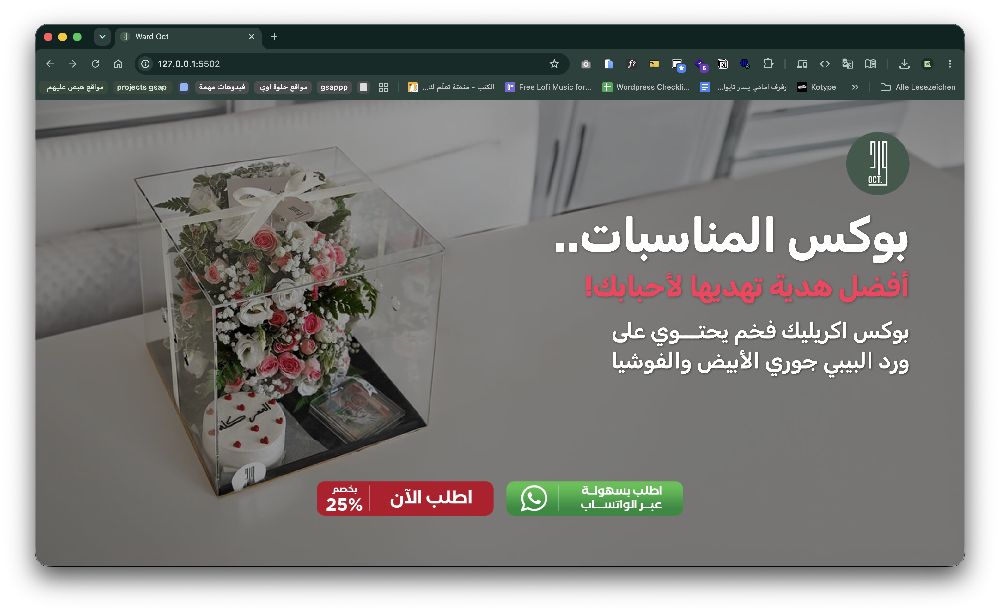
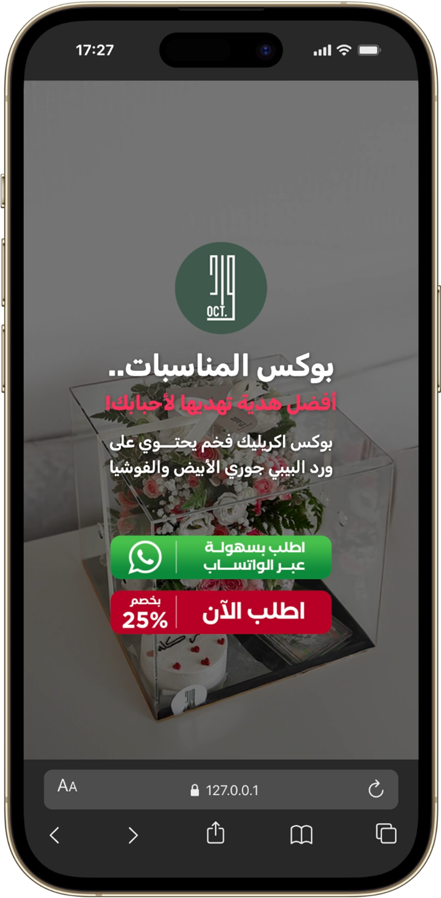

# 🌸 Ward October (ورد أكتوبر) - Landing Page

<p align="center">
  
</p>

<p align="center">
  <strong>A premium, fully responsive landing page built for "Ward October", specializing in luxury occasion boxes and premium flower arrangements.</strong>
</p>

<p align="center">
  
  
  
  
</p>

---

## 📸 Project Preview

> Experience the clean, pixel-perfect responsiveness of the landing page across desktop and mobile devices seamlessly.

| 💻 Desktop View | 📱 Mobile View |
| :---: | :---: |
|  |  |

---

## ✨ Key Features

* 📱 **Fully Responsive Layout:** Precision-tuned for a seamless user experience across Mobile, Tablet, and Desktop screens.
* 🎯 **Fluid Typography:** Implemented the modern CSS `clamp()` function, allowing headers to rescale smoothly without breaking layouts on smaller break-points.
* 🛍️ **Conversion-Optimized CTA:** Strategic placement of high-contrast WhatsApp order buttons designed to maximize customer inquiries.
* 📄 **Integrated Lead Capture:** A clean, user-friendly form section engineered to collect essential client delivery details dynamically.
* 🎠 **Dynamic Testimonials Slider:** An interactive, touch-friendly feedback carousel powered by **Swiper.js** showcasing genuine WhatsApp reviews.
* ⚡ **Production-Ready Architecture:** Clean, semantic HTML structure combined with modern CSS reset practices to ensure lightning-fast load speeds.

---

## 🛠️ Technologies Used

* **HTML5:** Semantic structures ensuring solid SEO fundamentals and clean document hierarchy.
* **CSS3:** Custom styles, dynamic transitions, smooth hover states, and standard modern layout mechanics.
* **Bootstrap 5:** Leveraging the robust fluid grid system for multi-column product card alignments.
* **JavaScript & jQuery:** Powering client-side interactions and plugin initializations.
* **Swiper.js:** Handling mobile-first responsive touch slider swipe controls.

---

## 📂 Project Structure

```text
├── .vscode/                             # Editor workspace settings
├── img/                                 # Project visual assets and graphics
│   ├── 002.png                          # Official company branding logo
│   ├── desktop.png                      # Desktop preview image
│   └── iPhone-14-PRO-MAX-127.0.0.1.png  # Mobile layout preview image
├── README.md                            # Comprehensive project documentation
├── index.html                           # Core semantic structure entry point
├── jquery-3.3.1.min.js                  # Production jQuery dependency core library
├── plugin.js                            # Custom dynamic scripts and slider initialization
├── style.css                            # Refactored stylesheet with custom media queries
└── thank.html                           # Post-submission redirection success page
